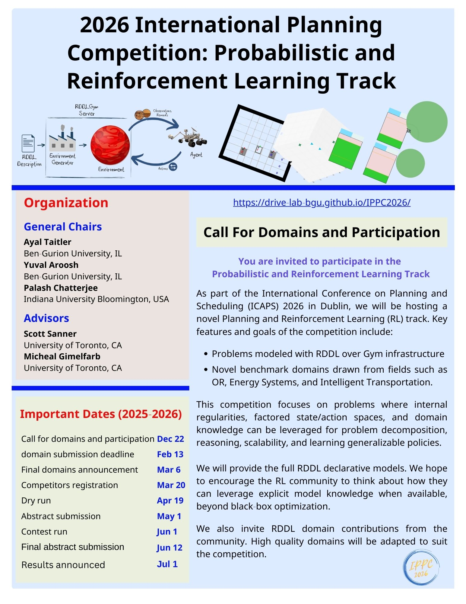

<b>Welcome to the International Planning Competition 2026: Probabilistic and Reinforcement Learning Track</b>

The International Probabilistic Planning Competition is organized in the context of the International Conference on Planning and Scheduling (ICAPS). It empirically evaluates state-of-the-art planning and Learning systems on a number of benchmark problems. The goals of the IPC are to promote research, highlight challenges in the planning community and provide new and interesting problems as benchmarks for future research.

Since 2004, probabilistic tracks have been part of the IPC under different names (as the International Probabilistic Planning competition or as part of the uncertainty tracks). After 2004, 2006, 2008, 2011, 2014, 2018, and 2023 the 8th IPPC will be held in 2026 and conclude together with ICAPS, in July 2026, in Dublin (Ireland). This time it is organized by Ayal Taitler, Yuval Aroosh and Palash Chatterjee.

## Calls
Please forward the following calls to all interested parties:
- [Call for Domains and Participation](/call_email.md)

  

We invite interested competitors to join the competition discussion:

   [ippc2026-rddl@googlegroups.com](https://groups.google.com/g/ippc2026-rddl)

## Preliminary Schedule

| Event                                         | Date              |
|:----------------------------------------------|:------------------|
| Call for domains and praticipants             | December, 2025    |
| Domain submission deadline                    | February 13, 2026 |
| Final domains announcement                    | March 6, 2026     |
| Competitors registration deadline             | March 20, 2026    |
| Dry-run                                       | April 19, 2026    |
| Planner abstract dubmission                   | May 1, 2026       |
| Contest run                                   | June 1-4, 2026    |
| Final planner abstract dubmission             | June 12, 2026     |
| Results announced                             | July 1, 2026     |

## Setup

This year's competition follow the previous iteration and will be using the generic pyRDDLGym - an autogeneration tool for gym environments from RDDL textual description.

More information about the infrastructure, how to use it and how to add user defined domains can be found the following short guide

- [Infrastructure guide](/infrastructure.md)

pyRDDLGym also comes with a set of auxiliary utils and baseline methods:

- [Tools and Baselines](/planning.md)

## Domains
We provide a sample of RDDL domains along with an evolving list of competition domains, including several classical control problems recreated in RDDL. We encourage the community to contribute user-defined domains or propose ideas that may be of interest to the broader community. Well-motivated and sufficiently mature suggestions may be considered for inclusion in the competition.

  

    <a href="rover.html">
      
      
Mars Rovers Science Mission

    </a>
  

  

    <a href="rover.html">
      
      
HVAC

    </a>
  

  

    <a href="uav.html">
      
      
UAV

    </a>
  

  

    <a href="reservoir.html">
      
      
Reservoir

    </a>
  

  

    <a href="cartpole.html">
      
      
Cart Pole

    </a>
  

  

    <a href="rover.html">
      
      
Traffic

    </a>
  

Note, that there are additional domains out there from past competitions (IPPC 2011, IPPC 2014), which can be also be used with pyRDDLSim:
- [IPPC 2011 domains](https://github.com/pyrddlgym-project/rddlrepository/tree/main/rddlrepository/archive/competitions/IPPC2011): This repository contains 8 domains: Elevators, Cross Traffic (Frogger), Game of Life, Navigation, Reconnaissance, Skill Teaching, SysAdmin, Traffic. 
- [IPPC 2014 domains](https://github.com/pyrddlgym-project/rddlrepository/tree/main/rddlrepository/archive/competitions/IPPC2014): This repository contains some of IPPC 2011 domains, with additional 4 new domains: Tamarisk (Invasive Species), Wildfire (Firefighting), Academic Advising, Triangle Tireword.
- [IPPC 2018 domains](https://github.com/pyrddlgym-project/rddlrepository/tree/main/rddlrepository/archive/competitions/IPPC2018): This repository contains 8 domains : AcademicAdvising ,
ChormaticDice ,CooperativeRecon , EarthObservation,Manufacturer , PushYourLuck , RedFinnedBlueEye , WildlifePreserve.
- [IPPC 2023 domains](https://github.com/pyrddlgym-project/rddlrepository/tree/main/rddlrepository/archive/competitions/IPPC2023): This repository contains 8 domains : HVAC ,
MarsRover ,MountainCar , PowerGen , RaceCar , RecSim , Reservoir , UAV.

The focus of this year’s competition is on continuous and mixed discrete-continuous problems like last year with some change. However, everybody are welcome to take advantage of their existance. All previous competition domains are avilavble through the [rddlrepository](https://github.com/ataitler/rddlrepository) package/git.

## Registration

Information will be release soon.

<!---Please register at the following link:

- [Registration form](https://forms.gle/W9ng4v3vciNcc9S27)

The registration will be closed on March 15, 2023. 
<!-- If you missed the deadline and wish to compete please contact one of the organizers (Ayal Taitler or Scott Sanner). -->

 
## Procedure
Information will be release soon.
### Final Competition Domains(TBD)
The competition will include:
- 8 domains (Hopefully 5 instances per domain )
- 5 instances per domain (released at competition time)

| Domain                | pyRDDLGym name         |
|:----------------------|:-----------------------|
| Reservoir Control     |  Reservoir_continuous  |
| HVAC                  |  HVAC                  |

more to come

Instance generators are available for all of these domains. The competition instances will be generated with these generators.
Documentation of the generators is available here:

- [Instance generators](/instancegen.md)

### Competition Dry-run
Information will be release soon.

### Evaluation and Scoring (TBD )
Information will be release soon.

## Organizers
- [Ayal Taitler](https://ataitler.github.io) (Ben-Gurion University of the Negev)
- [Yuval Aroosh](https://github.com/yuv-989) (Ben-Gurion University of the Negev)
- [Palash Chatterjee](https://pecey.github.io/) (Indiana University Bloomington)
## Advisors
- [Scott Sanner](https://d3m.mie.utoronto.ca/) (University of Toronto, CA)
- [Michael Gimelfarb](https://mike-gimelfarb.github.io/) (University of Toronto, CA)
Contact us: [ippc2026-rddl@googlegroups.com](https://groups.google.com/g/ippc2026-rddl)
